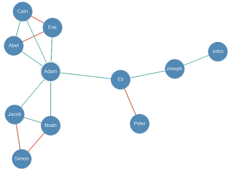
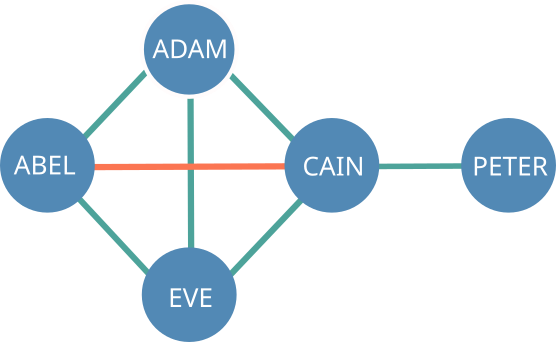
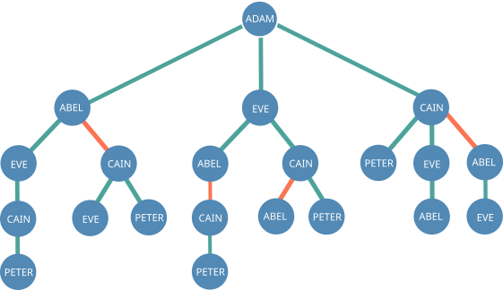
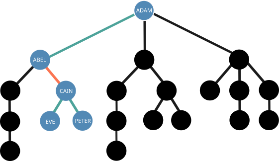
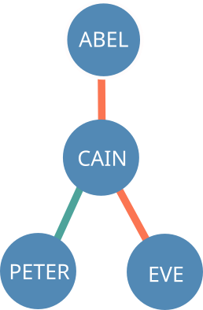

# Vouch Reputation System

Table of contents

1. [Introduction](#introduction)
2. [Vouching](#vouching)
3. [Reputation Score](#reputation)
4. [Security Concerns](#security)
    1. [Impersonation Attacks](#impersonation)
    2. [Vouch Forgery](#vouch_forgery)
    3. [Vouch Omission](#vouch_omission)
5. [Conclusion](#conclusion)

## Introduction <a name="introduction"></a>

Vouch Reputation System, or VRS for short, is a proof of concept for a decentralized reputation system for peer-to-peer networks.

The system's goal is to be a community-focused solution to the uncertainty of trust between unfamiliar peers in environments without authorities. Building upon already existing social bonds between its participants, VRS extrapolates a numerical reputation score for each node in the network in a way that reflects its standing on it.

In particular, VRS is suited for contexts where [complete]

This repository contains a small Python project for simulating a VRS network and calculating accurate reputation scores. Note that it is not a full implementation of a peer-to-peer network.

## Vouching <a name="vouching"></a>

In VRS, every entity (person, organization, etc.) is represented by a node. Nodes can vouch for or against any other, signalizing trust and mistrust respectively. Vouches can be retracted and altered at will. A node's vouches (both for and against) are public to all.

Vouches are stored in what's called a vouch history. It's an ordered sequence of vouches and their logical timestamp in a way that preserves their past and current vouches.

Take for example this vouch history:

| Logical Clock | Node    | Vouch   |
|---------------|---------|---------|
| 1             | Alice   | For     |
| 2             | Charlie | For     |
| 3             | Alice   | Against |

<p align="center">
    <i>This would mean that it's owner currently vouches for Charlie and against Alice, but previously vouched for Alice.</i>
</p>

Vouch connections are created between nodes depending on their vouches. If two nodes reciprocally vouch for the other, a vouch for connection is formed. If at least one of them vouches against the other, a vouch against connection is formed.

As such, the entities and their vouch connections can be displayed as a trust topology. When we are looking at the topology from the perspective of a particular node, we call it the observer node.

<p align="center">
    
    <p align="center">
        <i>Adam's trust topology. Vouch for relations are in green, vouch against relations in red. The observer node is circled in white.</i>
    </p>
</p>

The reputation of nodes in the network (including those the observer does not vouch for or against) can be assessed through the vouch connections there present.  

It's important to note that a node's reputation is not an intrinsic property it posesses but rather is contingent to an observer. The same node can have wildly different reputation scores when seen through the perspective of nodes with different vouch connections.

In concrete terms, let's say that Alice vouches for Bob. That means that Alice trusts him and is willing to put her own reputation on the line for him. If you yourself vouches for Alice but does not know Bob, you can reasonably assume that Bob is somewhat trustworthy based on his relationship with Alice. Reversely, Bob would seem untrustworthy to you had you vouched against Alice. Things would be more complicated were you connected to multiple nodes with different opinions on Bob, but the same logic applies.

Vouching is also a way for a node to make a public statement about some other's reputation while leaving it's own reputation as a collateral. That is to say, when a node vouches for some other it is essentially tying it's own reputation with the other's.

For instance, let's say you and Alice vouch for each other. If Bob were to distrust Alice and not know you, your own reputation (from his point of view) would be negatively affected by your association with Alice. Reversely, if Charlie does not know you but trusts Alice, your reputation would rise from his perspective. As before, things get more complex when the reputation of a node is affected by multiple sources.

Nodes may be connected to the observer by a varying degree of proximity. Naturally, the opinions of nodes closely connected to the observer carry more weight than those of distant ones. It's more impactful to be vouched by someone closer to the observer than by a distant connection.

Not only that, but the relevance of a node's opinion is also proportional to it's own reputation score. Let's say that Alice vouches for Bob and Charlie vouches against Bob, but Alice has a higher reputation score than Charlie. As Alice has a better standing on your network, Bob's reputation should be biased towards a good reputation score, rather than to be perfectly even between good and bad.

An observer can also apply a weight to every node. Weights serve as a multiplier for the node's opinion's relevance on the observer's network. For instance, even though you vouch for both Alice and Bob, you can make it so Bob's opinions are twice as relevant as Alice's by giving him a 2x weight while leaving Alice with the default 1x weight. Weights are not public information and can be kept private.

Finally, nodes that are deemed too loosely connected (or not connected at all) to the observer have no reputation score, as there is not enough meaningful data to estimate it. As such, they can be ommited from the network as far as the observer is concerned.

## Reputation Score <a name="reputation"></a>

The first step to understand how the reputation score is calculated is to convert the trust topology from a mesh to a tree.

Let's take this simple trust topolgy as an example:

<p align="center">
    
</p>

Converted into a tree, it would look as follows:

<p align="center">
    
</p>

The next step is to traverse every path in the tree starting from the observer node to attribute influence to nodes. At every visit during the traversal, we keep track of two things - the distance from the observer node and the current polarity of the branch, which combined are called what's called an influence.

The notation used to express an influence on node is a plus or minus sign (representing polarity) followed by an integer (representing the distance). e.g. +0, -1, -5.

To illustrate, let's analyze the influences on each node of this particular branch of the tree:

<p align="center">
    
</p>

| Node  | Influence |
|-------|-----------|
| Abel  | +0        |
| Cain  | -1        |
| Eve   | -2        |
| Peter | -2        |

Abel has an influence of +0 because it is directly vouched for by the Adam, the observer node. As they are directly connected, the distance is zero. Cain has an influence of -1 because it is vouched against Abel and is one node away from being directly connected to Adam. Eve and Peter both have a -2 influence. It's easy to see that the distance is two because they are both two nodes away from being directly connected to Adam, but why is the polarity negative if Cain vouches for them both?

During the process of attributing influence, if a previously unbroken chain of positive connections is followed by a negative connection, every following positive connection is turned into a negative one. Thus, the positive connections between Cain and Eve/Peter have negative polarity because Cain was vouched against by Abel earlier in the chain.

This is the "Friend of my enemiy is my enemy" policy. This is in place to make it so users are negatively impacted by associating with known bad actors, for reasons discussed later.

A similar policy not applicable is this example is the "Enemy of my enemy might not be my friend". It states that when attributing influence to nodes, a given branch can only have one negative connection in it. From the second negative onwards, the influences are ignored. This is in place because it does not logically follow that vouching against someone considered to be disreputable is somehow evidence of good behavior, as infighting between malefactors is possible.

<p align="center">
<p align="center">
    
</p>
    <i>Example of "Enemy of my enemy might not be my friend". Altough Peter is negatively affected by his positive connection with Cain, Eve is not affected at all by her negative connection.</i>
</p>

Back to the matter of influence. After going through all the paths in the tree, each node will have a list of influences:

| Node  | Influence          |
|-------|--------------------|
| Abel  | +0, +1, -2, -1, +2 |
| Cain  | +2, -1, -2, +1, +0 |
| Eve   | +1, -2, +0, +1, -2 |
| Peter | +3, -2, -3, +2, +1 |

The reputation scores are calculated from the influence lists according the following procedure:

```python
def calculateReputationScore(influences : list[tuple(int, bool)]) -> float
    """Calculates the score of a node given their influence list"""

    # weight is determined by the reverse square of the depth
    def weight(depth) -> float:
        return 2**(-depth)

    numerator = 0
    denominator = 0

    # calculate the effect of each influence in the overall score...
    for dist, polarity in influences:
        # adds to the numerator either zero or one (depending on polarity) times the weight as dictated by the distance to the observer
        numerator += (1 if polarity else 0) * weight(depth)

        # adds the weight to the denominator
        denominator += weight(depth)

    # calculate the weighted average
    score = numerator/float(denominator)
    # applies distance falloff
    score *= weight(dist_to_observer)
    return score
```
The snippet above is a simplified version of the function used in the Python project for the same effect.

And here's the reputation score of every node in the example's network as according to the Python simulator.

```
[user@Computer Vouch-Reputation-System]$ python main.py 

`7MMF'   `7MF'`7MM"""Mq.   .M"""bgd 
  `MA     ,V    MM   `MM. ,MI    "Y 
   VM:   ,V     MM   ,M9  `MMb.     
    MM.  M'     MMmmdM9     `YMMNq. 
    `MM A'      MM  YM.   .     `MM 
     :MM;       MM   `Mb. Mb     dM 
      VF      .JMML. .JMM.P"Ybmmd"  
      
        Vouch Reputation System
           Bruno Rocha Moura

Adam  : Observer
Eve : 80.0%
Cain : 70.0%
Abel : 70.0%
Peter : 35.0%
```

## Security Concerns <a name="security"></a>

### Impersonation Attacks <a name="impersonation"></a>

One way an adversary might attack the system is by impersonating another user. Let's explore ways this attack vector can be mitigated.

Every entity should possess a asymmetric key pair as a means of authentication. In fact, the public key of this key pair is what identifies a node in the network. Every message created by a node (e.g. vouch messages) is to be signed with their private key. As such, nodes can verify the authorship of received messages through the means of digital signatures. Messages with missing or otherwise invalid signatures should be dismissed.

Asymmetric cryptography solves the issue of impersonating an entity's in-system identity. However, it does nothing to address the matter of associating a real life identity to a in-system identity.

One way this can be solved it through certificates, perhaps in a decentralized fashion like in [PGP](https://en.wikipedia.org/wiki/Pretty_Good_Privacy#Certificates), where nodes can certify others of their real identity and those that trust them can choose to listen. There might also be scenarios in which tying real life identities to a in-system identity is undesirable and anonymity is preferred.

### Vouch Forgery <a name="vouch_forgery"></a>

As discussed previously, vouch messages ought to be signed by their issuer. As such, it's not possible to forge a vouch message without knowing the would be victim's private key, which of course should be kept secret.

### Vouch Omission <a name="vouch_omission"></a>

Say that Alice vouches for Bob. That is to say that she created a message vouching for Bob which is forwarded along the network to others. After some time, Bob behaves in some way that warrents disapproval by others in the network. Many users vouch against Bob, which significantly decreases his overall reputation. This, in turn, means that Alice is also negatively affected with their association with Bob so she chooses to retract her vouch.

For overall network health, it's important that users are held accountable not only for their current vouch relations, but their past ones as well. Otherwise, bad actors could band together without repercussion, as if one of them gets caught the rest can simply retract their vouches and be unaffected. Instead, a user's past vouches should play some role in it's reputation calculation.

Now let's say that a new user, Charlie, enters the network for the first time after the Bob fiasco. As he doesn't know anything yet, he needs to ask around for the vouches each node has in order to construct the trust topology. When asked to present her vouch history, Alice might be inclined to not let Charlie know about her past association with Bob as a way of preserving her reputation. If she sends a tampered version of her vouch history with that message missing, her reputation from Charlie's point of view may be artificially higher, misleading Charlie to trust Alice more than he might have had he known the full picture.

To prevent this scenario from happening, the first step is to make it so nodes don't just store the current vouch connections of the nodes they care about, but also have their previous vouches backed up. This can't be enforced, as users can always clean their cache to save disk space, but as long as at least one node within the victim's reach has the ommited message backed up the system can recover from vouch omission attacks.

Secondly, one should never ask a particular node about their vouch history. Instead, they should ask publicly about it so that anyone can chime in. This way, Charlie would ask anyone to provide for vouch messages made by Alice. Even if Alice omits her message vouching for Bob, another user that has it cached can interject and supply Charlie with the missing message. Alice can't repudiate the authenticity of the message as it contains a digital signature signed by her.

# Conclusion <a name="conclusion"></a>

Through VRS, users can assess anyone's (even complete strangers) trustworthiness through their reputation score as long as someone is their personal network is connected to them without, all without resorting to authority figures.

From it's set of rules emerges an entropic force that promotes network safety. Vouching in favor of a node which is generally considered to be untrustworthy will bring your own reputation score down to those that vouch against it. Reversely, vouching against a reputable account will also cause the same effect to those that vouch for it. Users that don't vouch for or against others when it becomes warranted will lose out on reputation gains, potentially new connections and a more accurate reputation estimate in their own personal network. In other words, users are incentivized to be consistent in their good behaviour and to ostracize actors that might compromise network safety, all for their own immediate self interest.

Just as well meaning users looking to maximize their own experience in the network are incentivized to be careful in regards to whom they associate with and be vigilant about troublemakers in their own personal network, malicious users are incentivized to act independently and not form connections between each other, as being associated with known bad actors will bring down their own reputation score, hampering coordination between malefactors.
